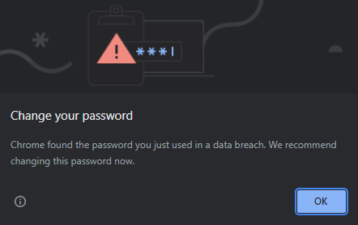

# User Authentication System

#### A user authentication system made with node.js and JWT

## Usage

#

> Make sure you have [node.js](https://nodejs.org/en/) and [mongoDB](https://www.mongodb.com/) installed on your system (Alternatively, you can use [mongoDB Atlas](https://www.mongodb.com/atlas) as your database server)

### Clone repository

```
git clone https://github.com/Kunalpatil22/user-authentication-system.git
```

### Open folder

```
cd user-authentication-system
```

### Install packages

```
npm install
```

> before running the server, create a `.env` file in the folder and put your mongodb connection string and JWT Secret Key like this

```
MONGO_URI = 'mongodb://localhost:27017/user-authentication-system'
SECRET_KEY = 'your_secret_key'
```

### Run server

```
npm start
```

> Server should be listening at http://localhost:3000

## miscellaneous warnings

#

If you are getting weak password warning on your chrome browser after login

<div align="center">
<br>

<br><br>
</div>

don't worry as it's just a feature of google chrome to periodically check for weak passwords.
